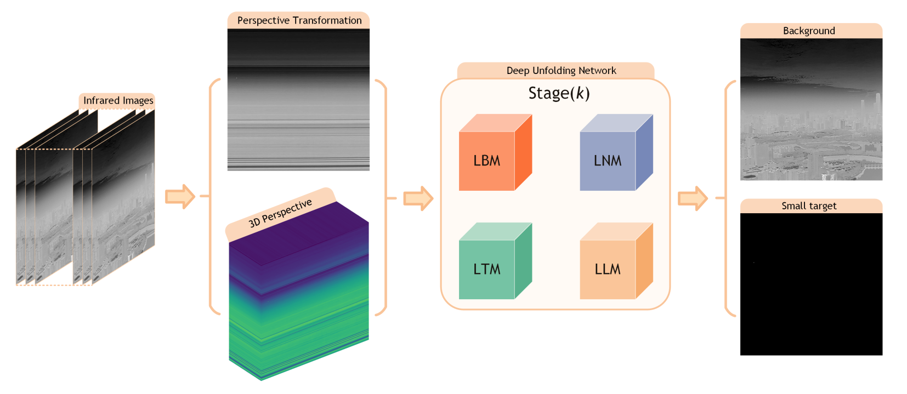

# LSNet
**From Optimization to Network: A Low-Rank and Sparse-Aware Deep Unfolding Framework for Infrared Small Target Detection**
Yongji Li, Luping Wang_*, and Shichao Chen_*

# Abstract
Infrared (IR) search and track systems are widely applied in aerospace and defense fields. Infrared small target detection (IRSTD) in heavy clouds and chaotic terrestrial environments remains a challenging task. Traditional physics-based models suffer from limited applicability in real-world vision tasks due to their reliance on manually tuned parameters and poor generalization. In contrast, deep neural networks, though impressive, inherently function as black boxes, lacking interpretability and transparency. Model-driven deep unfolding networks offer a promising alternative by fusing domain knowledge with learnable structures, enabling efficient parameter optimization through the unfolding process. To this end, we propose a low-rank and sparse-aware deep unfolding framework, termed LSNet. Specifically, the decomposition problem is reformulated as an implicit prior regularization model, and the iterative optimization process is unfolded into a deep neural network architecture. To avoid computationally expensive matrix operations, generalized sparse transformation and singular value thresholding are jointly learned through a State Space Model (SSM), which captures long-range dependencies, and a spatially-attentive network, which integrates fine-grained structural information. This design ensures both high generalization ability and interpretability, while enabling efficient small target detection. Both qualitative and quantitative experiments demonstrate that our proposed LSNet outperforms 14 recent benchmark algorithms on multiple public datasets.

<p align="center">

</p>


# Models
Quantitative comparison of model complexity with open source models:

|Methods   | FLOPs(G) | Params(M)   |
|--------|-----|--------|
| AGPCNet   | 172.86  | 12.36   |
| UIU-Net   | 218.35  | 50.54   |
| DNA-Net   | 56.68  | 4.70   |
| IAANet   | 1730.03  | 19.72   |
| ISTDU-Net   | 34.27  | 2.76   |
| GCLNet   | 22.53  | 19.04   |
| LSNet   | 24.46  | 2.18   |


# Code
The official repository of From Optimization to Network: A Low-Rank and Sparse-Aware Deep Unfolding Framework for Infrared Small Target Detection.
  ```
The key package has been provided. Once the paper is accepted, we will release all the codes publicly. Please stay tuned for future updates. 
  ```

# Contact
If you have any questions, please contact Yongji Li (liyj328@mail2.sysu.edu.cn).


